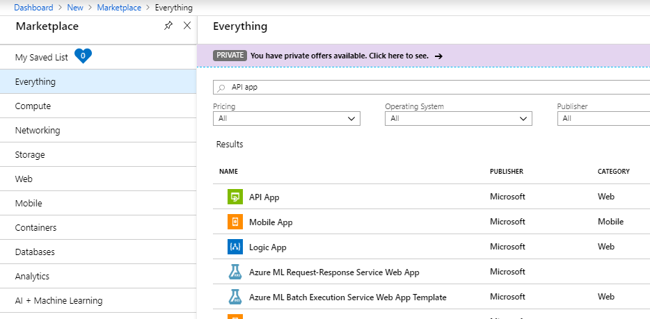
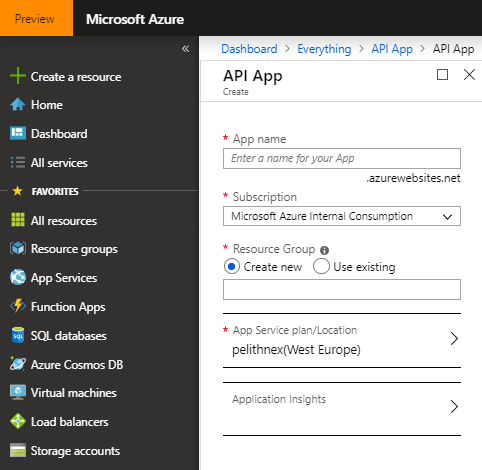
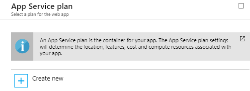
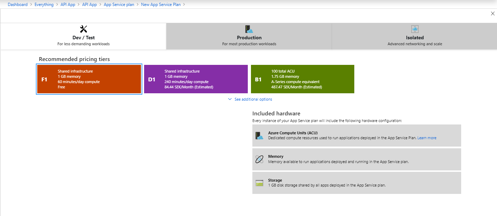
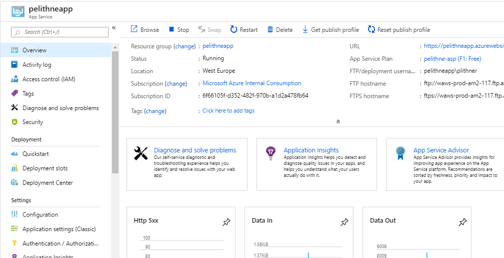
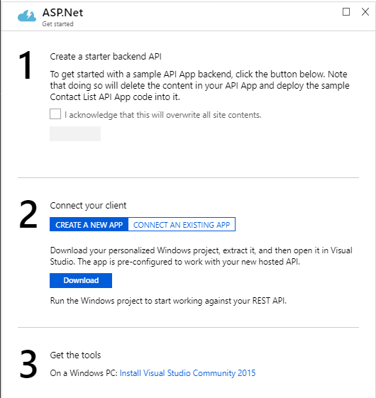
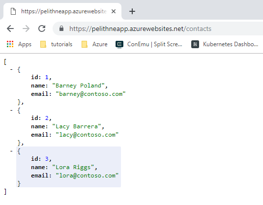
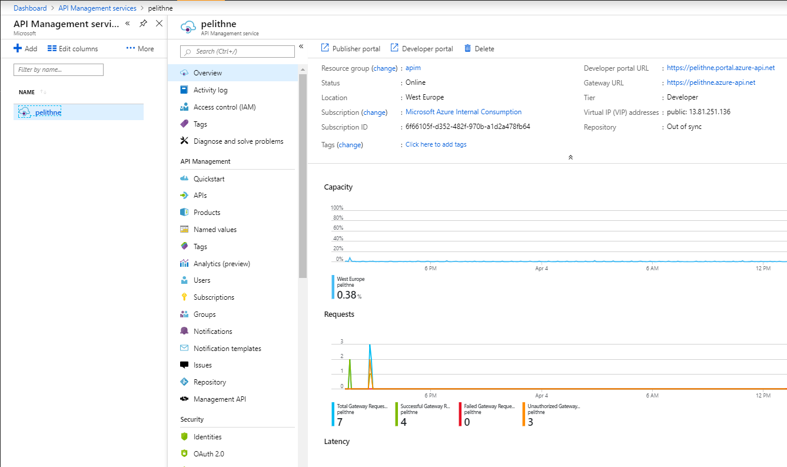
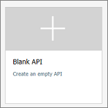

# API Management workshop

## Intro
This tutorial attempts to give insights into how and why to use API Management, when building your API services. It starts from the basics of creating a simple API app, and then to manually configuring API management to connect to that API. It goes on to give examples on how you can secure your API, how to mock API responses, how to do version handling, and more.

## Prerequisite
This instruction assumes that an API management instance is already started. If that is not the case, please follow the istructions <a href="https://docs.microsoft.com/en-us/azure/api-management/get-started-create-service-instance">here</a> to create one: 

## API endpoint
API management service does not host APIs directly. Instead it works like a proxy towards "backend" APIs. The first thing we need to do is to create such an API. 

### Create API App
Creating an API app involves a few steps, but it boils down to creating an **App Service plan**, which is the infrastructure in which your API app will run, and then to create the API app it self.

1. Sign in to the Azure portal.

2. Click **Create a resource**

3. In the search field, type **API app** eand press enter.

4. Select the **API App** in the list of services

 

5. Click **Create**

After a little time, you will see something similar to this

 

Now you will input some details bout your **API app**. In the 

1. Give the app a nice (and globally unique) name. For instance, use your corporate signum

2. Select the **Subscription** you want to use

3. In the **Resource group** section, select **Create new**. By default it will get the same name you gave your API app

4. Next, you need to create a **App Service Plan**. Click on the arrow to the right, and choose **Create new** in the blade that opens up

 


5. Give the **App Service plan** a nice name (which does not have to be globally unique :-) )

6. Chose **West Europe**  for location

7. Select **Dev/Test** and then **F1** (free) and then **Apply**

 

7. Press **OK** to create the App Service plan

8. Leave the **Application Insights** as default, and the press **Create**

### Build the API application
We will use a quickstart from the Azure portal to create the API backend. The quickstart will upload a basic "Contact list" API, and deploy it to your web app.

When the API app has completed creating, you will see a view similar to this

 

Now, select **Quickstart** in the panel to the left. Then, in the blade that opens up, choose **ASP.NET**. You will see something like this:

 

You only have to care about **step 1** for now. Just select the checkbox to acknowledge that this will overwrite all site contents. Then click the (perhaps empty...) button that appears. This will deploy the API app to your API app.

The address of your newly created API app can be found in the **Overview** page of the API app, and should look similar to ````https://pelithneapp.azurewebsites.net````. 

In order to see a response from your app, you can use your browser and navigate to ````https://pelithneapp.azurewebsites.net/contacts````

You should see something like this:

 


## Add an API to API management manually
The following steps show how to use the Azure portal to add an API manually to the API Management (APIM) instance. 

### Go to your API Management instance

To start with, you need to access you API management service, by following these steps:

1. Sign in to the Azure portal, unless already logged in.

2. Select **All services**.

3. In the search box, enter api management.

4. In the search results, select **API Management** services.

5. Select your API Management service instance.

You should see something similar to this:
 

### Create an API 
Select APIs from under **API Management**.

From the menu that opens to the right, select **+ Add API**.

Select **Blank API**.

 

In the dialogue that appears, enter a name, a URL to your API app and select **Unlimited** as Product. 


The click on the **Create** button.

After a short while, you will see that your new API has been created. At this point, you have no operations in APIM that map to the operations in your back-end API. If you call an operation that is exposed through the back end but not through the APIM, you get a 404.

### Add and test an operation
This section shows how to add an operation in order to map it to the back end operation.

#### Add an operation
1. Select the API you created in the previous step.
2. Click + Add Operation.
3. Enter "Contacts" for Display name.
4. In the URL, select GET and enter "/contacts" in the resource.
5. Select Save.


#### Test an operation
Test the operation in the Azure portal. Alternatively, you can test it in the Developer portal or using a tool like **Postman**.

1. Select the Test tab.
2. Select Contacts.
3. Press Send.

You should see a reponse that looks very similar to what you saw in the browser previously


