# API Management workshop

## Intro
This tutorial attempts to give insights into how and why to use API Management, when building your API services. It starts from the basics of creating a simple API app, and then to manually configure API management to connect to that API. It goes on to give examples on how you can secure your API, how to mock API responses, how to do version handling, and more.

## Prerequisite
This instruction assumes that an API management instance is already started. If that is not the case, please follow the istructions <a href="https://docs.microsoft.com/en-us/azure/api-management/get-started-create-service-instance">here</a> to create one: 

## API endpoint
API management service does not host APIs directly. Instead it works like a proxy towards "backend" APIs. The first thing we need to do is to create such an API. 

### Create API App
Creating an API app involves a few steps, but it boils down to creating an **App Service plan**, which is the infrastructure in which your API app will run, to create the API app service, and to upload the code of the API appliction.

1. Sign in to the Azure portal.

2. Click **Create a resource**

3. In the search field, type **API app** and press enter.

4. Select the **API App** in the list of services

 

5. Click **Create**

<BR/>
After a little time, you will see something similar to this

 
<BR/>

Now you will input some details bout your **API app**.

1. Give the app a nice (and globally unique) name. For instance using your corporate signum

2. Select the **Subscription** you want to use

3. In the **Resource group** section, select **Create new**. By default it will get the same name you gave your API app

4. Next, you need to create a **App Service Plan**. Click on the arrow to the right, and choose **Create new** in the blade that opens up

 


5. Give the **App Service plan** a nice name (which does not have to be globally unique :-) )

6. Chose **West Europe**  for location

7. Select **Dev/Test** and then **F1** (free) and then **Apply**

 

8. Press **OK** to create the App Service plan

9. Leave the **Application Insights** as default, and the press **Create** to create the API App.

<BR/>

### Build the API application
When the API app has completed creating, you will see a view similar to this


<BR/>

We will use a quickstart from the Azure portal to create the API backend. The quickstart will upload a basic "Contact list" API, and deploy it to your web app.

Select **Quickstart** in the panel to the left. Then, in the blade that opens up, choose **ASP.NET**. You will see something like this:

 

You only have to care about **step 1** for now. Just select the checkbox to acknowledge that this will overwrite all site contents. Then click the (perhaps empty...) button that appears. This will deploy the API app to your API app.

The address of your newly created API app can be found in the **Overview** page of the API app, and should look similar to ````https://pelithneapp.azurewebsites.net````. 

In order to see a response from your app, you can use your browser and navigate to ````https://pelithneapp.azurewebsites.net/contacts````

You should see something like this:

 


## Add an API to API management manually
The following steps show how to use the Azure portal to add an API manually to the API Management (APIM) instance. 

### Go to your API Management instance

To start with, you need to access you API management service, by following these steps:

1. Sign in to the Azure portal, unless already logged in.

2. Select **All services**.

3. In the search box, enter api management.

4. In the search results, select **API Management** services.

5. Select your API Management service instance.

You should see something similar to this:
 
<BR/>

### Create an API 
Select APIs from under **API Management**.

From the menu that opens to the right, select **+ Add API**.

Select **Blank API**.

 

In the dialogue that appears, enter a name, a URL to your API app and select **Unlimited** as Product. 

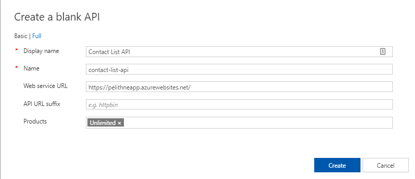

The click on the **Create** button.
<BR/>

After a short while, you will see that your new API has been created. At this point, you have no operations in APIM that map to the operations in your back-end API. If you call an operation that is exposed through the back end but not through the APIM, you get a 404.

### Add and test an operation
This section shows how to add an operation in order to map it to the back end operation, and then to test the API.

#### Add an operation
1. Select the API you created in the previous step.
2. Click + Add Operation.
3. Enter "Contacts" for Display name.
4. In the URL, select GET and enter "/contacts" in the resource.
5. Select Save.

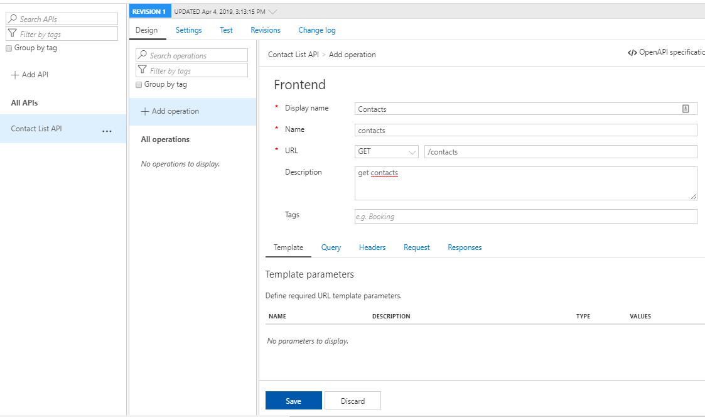


#### Test an operation
Test the operation in the Azure portal. 

1. Select the Test tab.
2. Select Contacts.
3. Press Send.

You should see a reponse that looks very similar to what you saw in the browser previously.

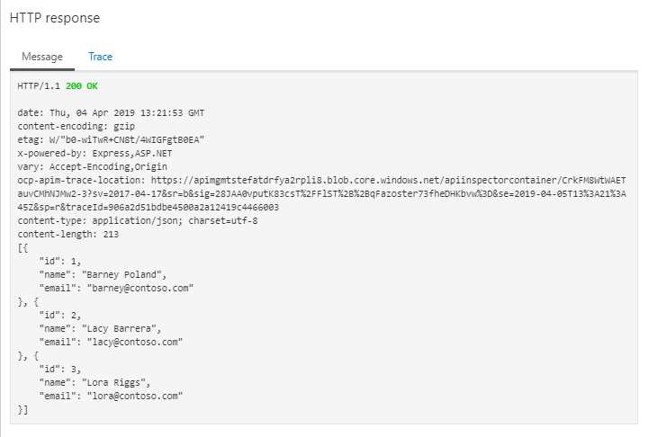


If instead you open up this new API URL in a browser, you will get a response similar to this:

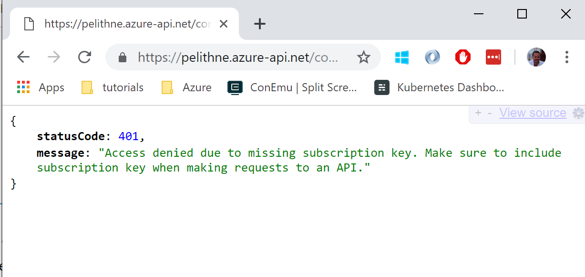 
<BR/>

As the error message indicates, this is because we have protected the API with a subscription. This key needs to be passed in an HTTP header along with the GET request. One easy way of sending an HTTP request with a custom HTTP header is to use the tool **Postman** (https://www.getpostman.com/). 

The custom header you need to add is named ````Ocp-Apim-Subscription-Key````. You can find this info under ````settings````. 

The value for the key can be found in the **Subscription** field of the API Management instance
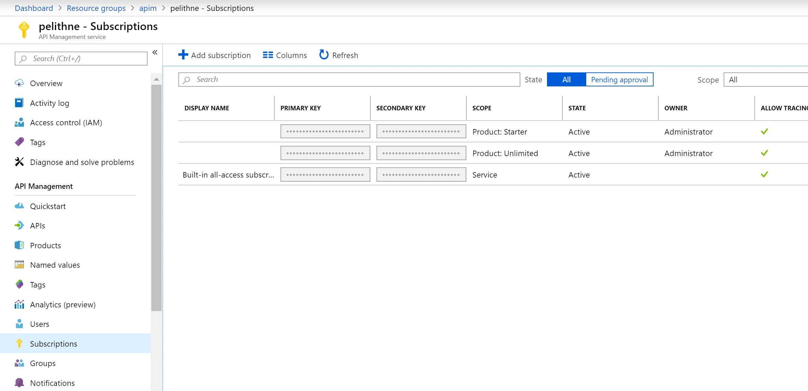
<BR/>

You need the key under ````Product:Unlimited```` because that was the product we used when creating the API. Click on the the dots at the far end to display the key, and make a copy of it.

After pasting the URL and the HTTP header into Postman, your request would look something like:
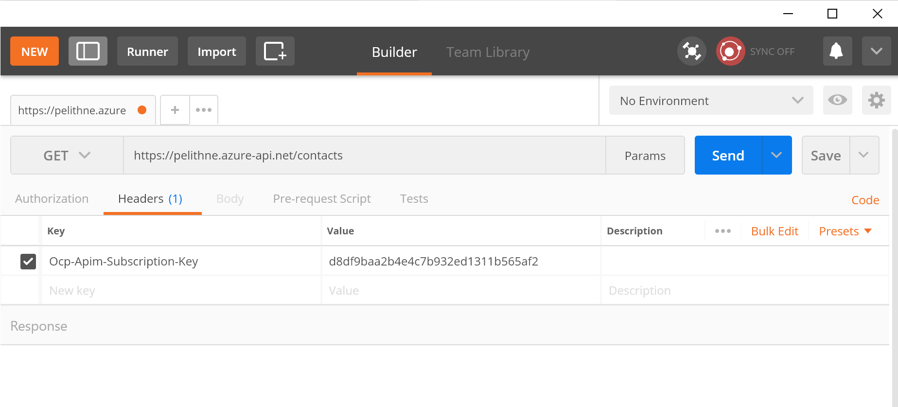 

You should get a response that, once again, looks the same as before:
````
[
    {
        "id": 1,
        "name": "Barney Poland",
        "email": "barney@contoso.com"
    },
    {
        "id": 2,
        "name": "Lacy Barrera",
        "email": "lacy@contoso.com"
    },
    {
        "id": 3,
        "name": "Lora Riggs",
        "email": "lora@contoso.com"
    }
]
````


## Import an Open API (swagger)
Another way of defining an API in the API management service, is to import it from the API Endpoint, using the **Open API Specification** (previously **Swagger**). 

It so happens that the API App you created previously also includes an Open API Specification, and we will use that interface. The process is very similar to what we did in the previous step.

Go to your **API Management** page:
 

### Create an API 
Select APIs from under **API Management**.

From the menu that opens to the right, select **+ Add API**.

Select **OpenAPI**.

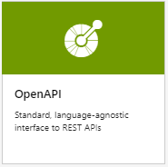 
<BR/>

In the dialogue that opens up, just enter the URI to the swagger definition of the API you created previously. You get to the defenition using the path ````/swagger/docs/v1```` so the URI you should enter will look similar to 
````
https://pelithneapp.azurewebsites.net/swagger/docs/v1
````

When you have entered a correct URI, the API details will be automatically populated, and look similar to this:
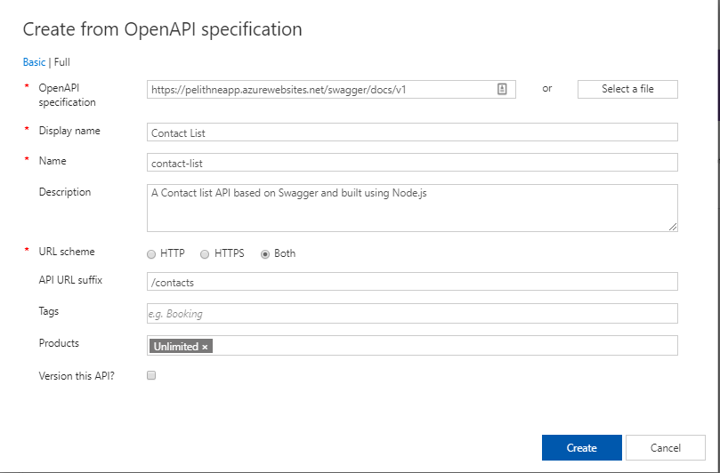 

You need to add **API URL Suffix** ````/contacts```` and **Products** ````unlimited```` before clicking **Create**

### Test the API
The procedure to test the API is the same as before

1. Go to your API Management instance
2. Select the API you created in the previous step
3. Select the Test tab.
4. Select Contacts

Here you can make a note of the **Request URL** for later use (you can find this URL under ````settings```` as well)

5. Click the **Send** button

After some time, you should get a response that looks very similar to the test response you received when you tested the interface the previous time.
<BR/>

If you want to, you can try again to access the URL with **Postman**, and try to fix the problem with the missing subscription key.
<BR/>


### Create a new Product
From the API Management instance, select **Products** in the left hand menu, and then click **Add**. In the blade that opens up, give the product a name (call it **contactlist**), a description and select the **Contact list API**. Then click **Create**

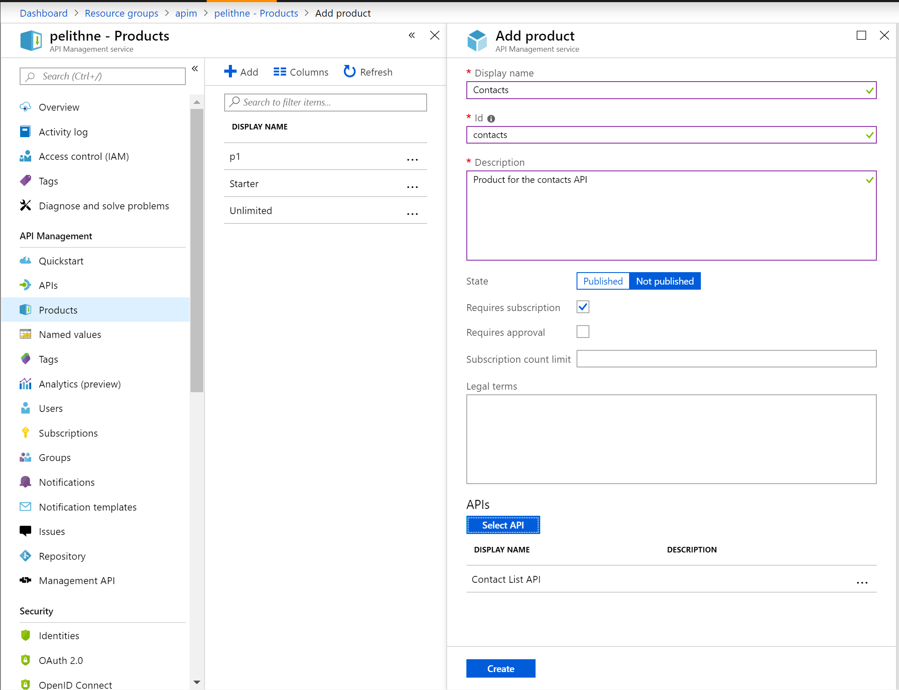 

<BR/>
Now the Contact list API belongs to this product, as well as the Unlimited product. YOu can try this out by using Postman to send a GET request to the API URL again, but this time using the subscription key that belongs to the new (contactlist) product. 

<BR/>

You can now remove the API from the Unlimited product, by going to the Unlimited product, and clicking the three dots next to the Contact list API

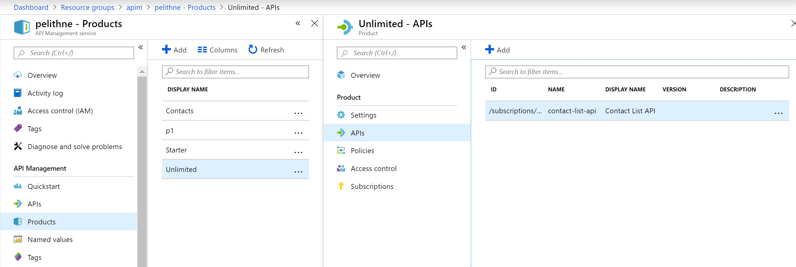 

<BR/>
    
If, at this point, you try to send a request with Postman using the Subscription key belonging to the Unlimited product, your requst will fail.
 
 ````
 {
    "statusCode": 401,
    "message": "Access denied due to invalid subscription key. Make sure to provide a valid key for an active subscription."
}
````
<BR/>

If you use the Subscription key from the newly created contactlist product, the request will still be successful
````
[
    {
        "id": 1,
        "name": "Barney Poland",
        "email": "barney@contoso.com"
    },
    {
        "id": 2,
        "name": "Lacy Barrera",
        "email": "lacy@contoso.com"
    },
    {
        "id": 3,
        "name": "Lora Riggs",
        "email": "lora@contoso.com"
    }
]
````
<BR/>

### Add a policy
Policies are ways to manipulate the request or the reponse in certain ways. For instance, you can add a policy that modifies a string in the response, to some other string. 

To do this, go to the newly created product (contactlist), the select **Policies**. This will open up a policy editor. In the policy editor, place the curson on the line between ````<outbound>```` and ````</outbound>````. Then click the plus sign next to "find and replace string in body".

Then modify to something similar to the image below, and then **save**

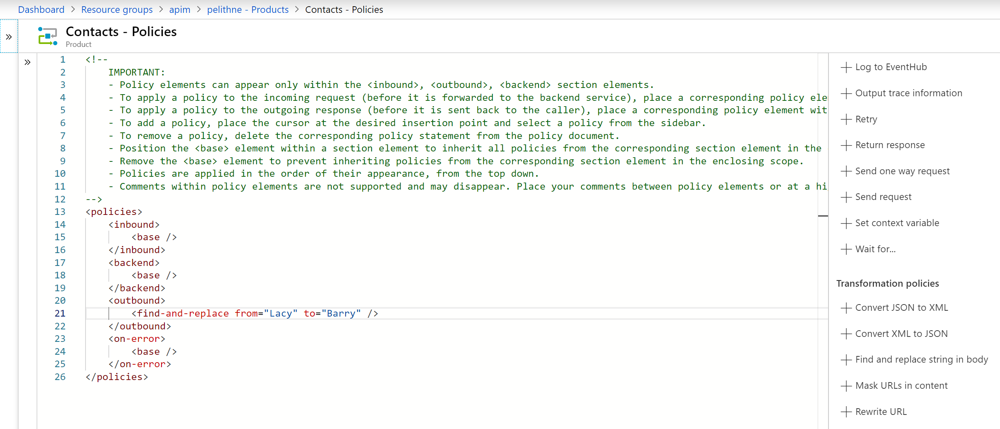 

<BR/>

It might take a little time, but after a while you should get a response similar to this instead of the old one:

````
[
    {
        "id": 1,
        "name": "Barney Poland",
        "email": "barney@contoso.com"
    },
    {
        "id": 2,
        "name": "Barry Barrera",
        "email": "lacy@contoso.com"
    },
    {
        "id": 3,
        "name": "Lora Riggs",
        "email": "lora@contoso.com"
    }
]
````
<BR/>
Feel free to experiment with some other Policies before calling this a day! Well done, you have finished this tutorial!

